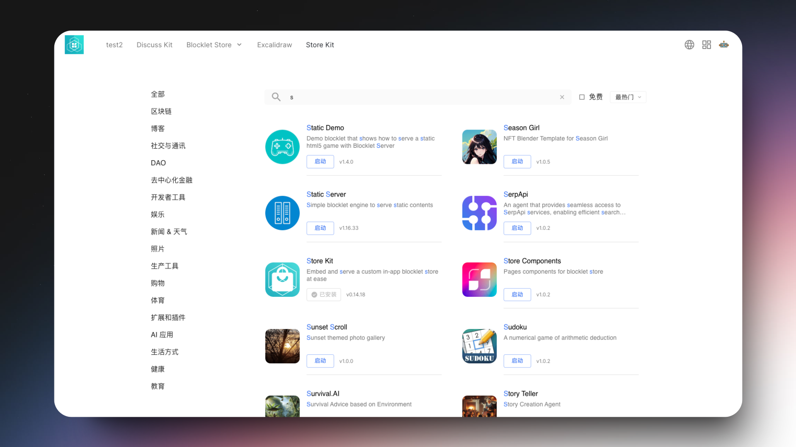
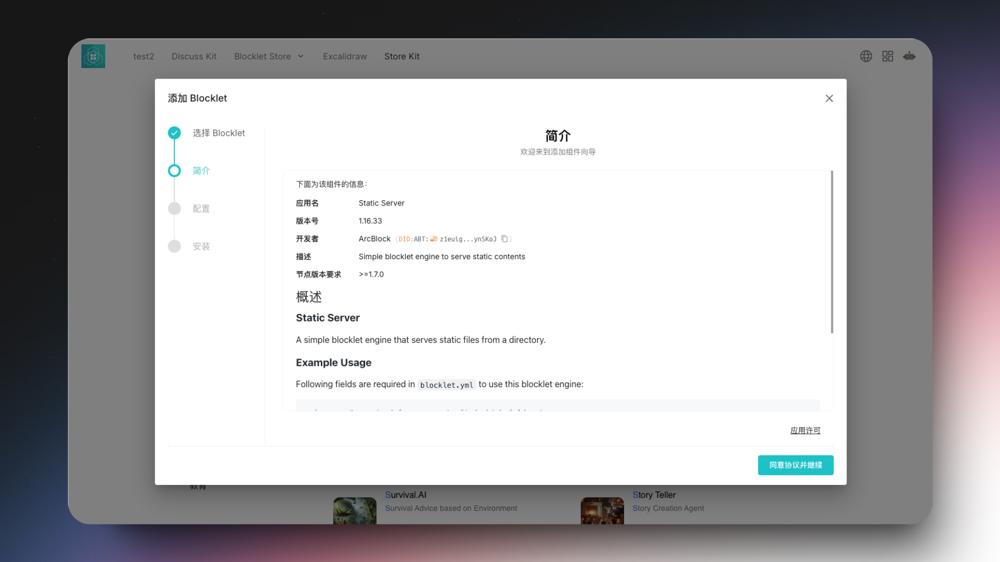

# Store Kit

## Overview

A simple blocklet to support in-app blocklet listing from a store. In which you can configure the listing with multiple blocklet filters.

## Features

### Customizable Filter Params

You can customize the filter params to list the blocklets from the store.

### Customizable Button Text

You can customize the button text with different action button.

### Seamless Component Addition Experience

You can add the blocklet to your project with a single click.

